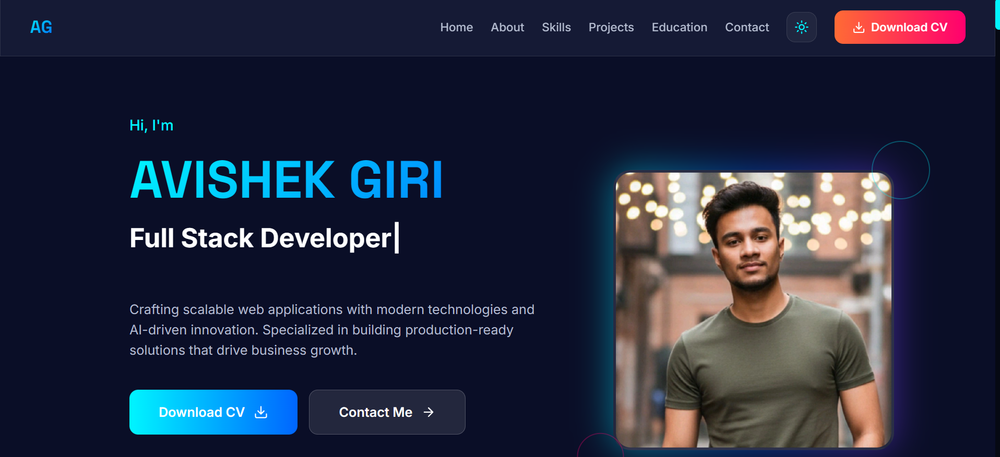

# 🚀 Portfolio Website - Avishek Giri

<div align="center">

[](https://reactjs.org/)
[](https://vitejs.dev/)
[](https://tailwindcss.com/)
[](https://nodejs.org/)
[](https://expressjs.com/)
[](https://www.mongodb.com/)
[](LICENSE)

**A high-performance, aesthetically stunning MERN stack portfolio featuring a dynamic admin panel, cloud-based asset management, and an intelligent AI chatbot.**

[View Live Demo](https://coderavi.in) · [Report Bug](https://github.com/im-coderavi/Portfolio/issues) · [Request Feature](https://github.com/im-coderavi/Portfolio/issues)



</div>

---

## 📖 About The Project

This portfolio is a statement of engineering excellence and design precision. Built with the latest **MERN stack** technologies, it features a **glassmorphism-inspired UI**, fluid animations, and a robust backend infrastructure. The project is designed to be fully responsive, ensuring a seamless experience across all devices, from mobile phones to 4K desktops.

### Key Features

#### 🎨 Frontend Excellence
-   **Modern Glassmorphism Design**: A visually striking interface with translucent elements, vibrant gradients, and depth.
-   **Framer Motion Animations**: Silky smooth transitions, scroll-triggered reveals, and interactive micro-interactions.
-   **Ultra-Responsive Layout**: Meticulously crafted using Tailwind CSS to look perfect on any screen size.
-   **Interactive Components**:
    -   **Dynamic Hero Section**: Engaging typing animations and 3D-like visuals.
    -   **Project Gallery**: Filterable grid system showcasing work with Cloudinary-hosted images.
    -   **Experience Timeline**: A vertical journey through professional milestones.
    -   **Live Contact Form**: Instant email delivery via Nodemailer with spam protection.

#### 🤖 Smart AI Chatbot
-   **Intelligent Assistant**: A custom-built chatbot that acts as a personal assistant, answering questions about skills, experience, and availability.
-   **Context-Aware**: Uses a sophisticated rule-based engine (with experimental Gemini AI integration) to provide accurate, context-aware responses.
-   **Lead Generation**: Capable of guiding visitors towards collaboration and scheduling calls.

#### 🔐 Robust Admin Panel
-   **Secure Authentication**: JWT-based login system protecting all administrative routes.
-   **CMS Capabilities**:
    -   **Project Management**: Add, edit, and delete projects with drag-and-drop image uploads directly to Cloudinary.
    -   **Experience Management**: Update work history in real-time without touching code.
    -   **Settings Control**: Toggle features like email notifications, update AdSense codes, and manage global site settings.

#### 🛠️ Backend Architecture
-   **Serverless-Ready**: Optimized structure for seamless deployment on Vercel Serverless Functions.
-   **Cloudinary Integration**: High-performance image CDN for optimized asset delivery.
-   **MongoDB Atlas**: Scalable, cloud-native database for persistent data storage.
-   **Security First**: Implemented CORS policies, Helmet security headers, and input validation.

---

## 🛠️ Tech Stack

### Frontend
-   **Framework**: [React 19](https://react.dev/)
-   **Build Tool**: [Vite](https://vitejs.dev/)
-   **Styling**: [Tailwind CSS v3](https://tailwindcss.com/), [PostCSS](https://postcss.org/), [Autoprefixer](https://github.com/postcss/autoprefixer)
-   **Animations**: [Framer Motion](https://www.framer.com/motion/)
-   **Routing**: [React Router DOM v7](https://reactrouter.com/)
-   **Icons**: [Lucide React](https://lucide.dev/), [React Icons](https://react-icons.github.io/react-icons/)
-   **State/Data**: [Axios](https://axios-http.com/), [React Hook Form](https://react-hook-form.com/), [Zod](https://zod.dev/)

### Backend
-   **Runtime**: [Node.js](https://nodejs.org/)
-   **Framework**: [Express.js](https://expressjs.com/)
-   **Database**: [MongoDB Atlas](https://www.mongodb.com/atlas) with Mongoose ODM
-   **Authentication**: [JSON Web Tokens (JWT)](https://jwt.io/)
-   **Storage**: [Cloudinary](https://cloudinary.com/) (Multer Storage Cloudinary)
-   **Email**: [Nodemailer](https://nodemailer.com/)
-   **AI**: [Google Generative AI (Gemini)](https://ai.google.dev/) (Infrastructure ready)

### DevOps & Tools
-   **Deployment**: [Vercel](https://vercel.com/) (Frontend & Backend)
-   **Version Control**: Git & GitHub

---

## ⚡ Getting Started

Follow these instructions to set up the project locally for development and testing.

### Prerequisites

Ensure you have the following installed:
-   **Node.js** (v18 or higher)
-   **npm** or **yarn**
-   **Git**
-   **MongoDB Atlas Account**
-   **Cloudinary Account**
-   **Google Account** (for Gmail SMTP or App Password)

### Installation

1.  **Clone the Repository**
    ```bash
    git clone https://github.com/im-coderavi/Portfolio.git
    cd Portfolio
    ```

2.  **Backend Setup**
    Navigate to the server directory and install dependencies:
    ```bash
    cd server
    npm install
    ```

    Create a `.env` file in the `server` directory based on `.env.example`:
    ```env
    # Server Configuration
    PORT=5000

    # MongoDB Database Connection
    MONGODB_URI=your_mongodb_connection_string

    # Security
    JWT_SECRET=your_super_secret_jwt_key
    ADMIN_PASSWORD=YourStrongAdminPassword

    # Email Configuration (Gmail App Password)
    EMAIL_USER=your-email@gmail.com
    EMAIL_PASS=your-app-password
    RECIPIENT_EMAIL=your-receiving-email@gmail.com

    # Cloudinary Configuration
    CLOUDINARY_CLOUD_NAME=your_cloud_name
    CLOUDINARY_API_KEY=your_api_key
    CLOUDINARY_API_SECRET=your_api_secret

    # AI Integration (Optional)
    GEMINI_API_KEY=your_gemini_api_key
    ```

    Start the development server:
    ```bash
    npm run dev
    ```

3.  **Frontend Setup**
    Open a new terminal, navigate to the client directory, and install dependencies:
    ```bash
    cd ../client
    npm install
    ```

    Start the frontend development server:
    ```bash
    npm run dev
    ```

    Visit `http://localhost:5173` to view the application.

---

## 📁 Project Structure

```bash
PORTFOLIO/
├── client/                 # Frontend Application (React + Vite)
│   ├── public/             # Static assets (ads.txt, icons)
│   ├── src/
│   │   ├── assets/         # Images, fonts, and global assets
│   │   ├── components/     # Reusable UI components
│   │   │   ├── admin/      # Admin specific components
│   │   │   ├── chatbot/    # AI Chatbot components
│   │   │   ├── common/     # Shared components (Buttons, Inputs)
│   │   │   ├── layout/     # Structural components (Navbar, Footer)
│   │   │   └── sections/   # Page sections (Hero, Projects, Contact)
│   │   ├── config/         # App configuration (API URL)
│   │   ├── context/        # Global state management
│   │   ├── hooks/          # Custom React hooks
│   │   ├── pages/          # Application routes
│   │   ├── styles/         # Global styles and Tailwind directives
│   │   └── utils/          # Helper functions
│   └── ...config files     # Vite, Tailwind, ESLint configs
│
├── server/                 # Backend API (Node.js + Express)
│   ├── config/             # Configuration (Chatbot logic, Gemini)
│   ├── models/             # Mongoose schemas (Project, Experience, Settings, Message)
│   ├── routes/             # API Routes
│   ├── uploads/            # Local directory for file uploads (dev only)
│   ├── .env                # Environment variables
│   ├── index.js            # Main server entry point
│   └── vercel.json         # Vercel deployment configuration
│
└── README.md               # Project documentation
```

---

## 🚀 Deployment

The project is optimized for **Vercel**.

### Backend Deployment
1.  Push your code to GitHub.
2.  Import the `server` directory as a project in Vercel.
3.  Add all environment variables from your `.env` file to Vercel Settings.
4.  Deploy.

### Frontend Deployment
1.  Import the `client` directory as a project in Vercel.
2.  Add the `VITE_API_URL` environment variable pointing to your deployed backend URL (if configured) or ensure your `client/src/config/api.js` points to the correct backend.
3.  Deploy.

---

## 🔐 API Reference

| Method | Endpoint | Description | Access |
| :--- | :--- | :--- | :--- |
| `GET` | `/api/projects` | Retrieve all portfolio projects | Public |
| `GET` | `/api/experiences` | Retrieve work experience timeline | Public |
| `POST` | `/api/contact` | Send a contact form message | Public |
| `POST` | `/api/chat/message` | Send a message to the AI Chatbot | Public |
| `POST` | `/api/admin/login` | Authenticate as admin | Public |
| `POST` | `/api/admin/projects` | Create a new project | **Admin** |
| `PUT` | `/api/admin/projects/:id` | Update an existing project | **Admin** |
| `GET` | `/api/admin/settings` | Get site settings | **Admin** |
| `POST` | `/api/admin/settings` | Update site settings (toggle notifications, etc.) | **Admin** |

---

## 🤝 Contributing

Contributions are what make the open-source community such an amazing place to learn, inspire, and create. Any contributions you make are **greatly appreciated**.

1.  Fork the Project
2.  Create your Feature Branch (`git checkout -b feature/AmazingFeature`)
3.  Commit your Changes (`git commit -m 'Add some AmazingFeature'`)
4.  Push to the Branch (`git push origin feature/AmazingFeature`)
5.  Open a Pull Request

---

## 📄 License

Distributed under the MIT License. See `LICENSE` for more information.

---

<div align="center">

**Designed & Developed with ❤️ by [Avishek Giri](https://coderavi.in)**

</div>
